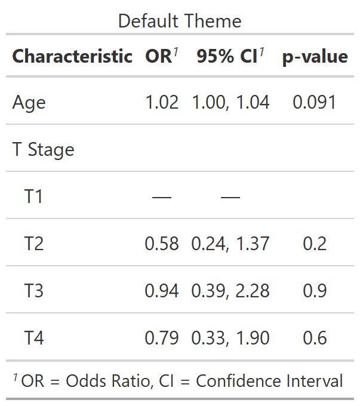
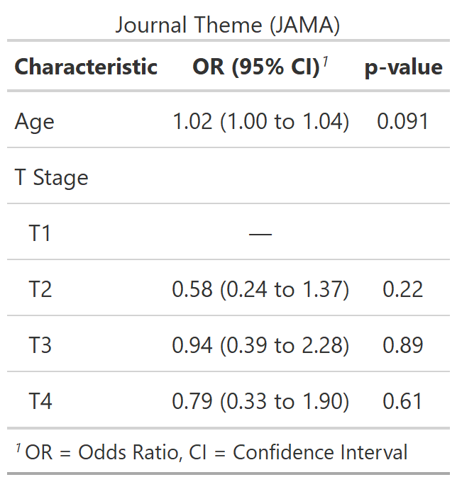
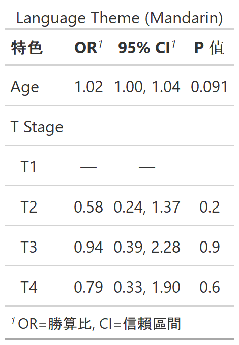
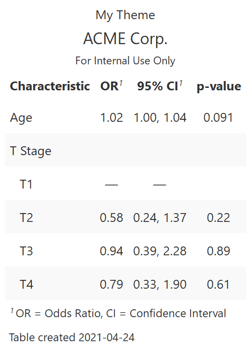

class: inverse, center, middle
# {gtsummary} themes

---
# {gtsummary} theme basics

.large[
- A **theme** is a set of customization preferences that can be easily set and reused. 

- Themes control **default settings for existing functions**

- Themes control more **fine-grained customization** not available via arguments or helper functions

- Easily use one of the **available themes**, or **create your own**
]


---
# {gtsummary} default theme

.pull-left[

```{r results=FALSE}
reset_gtsummary_theme()

no_theme <- 
  tbl_regression(m1, exponentiate = TRUE) %>%
  modify_caption("Default Theme")
```

```{r include = FALSE}
my_gtsave("no_theme")
```
]

.pull-right[
<p align="center"></p>
]


---
# {gtsummary} theme_gtsummary_journal()

.pull-left[

```{r results=FALSE, message = FALSE}
reset_gtsummary_theme()

theme_gtsummary_journal(journal = "jama")

jama_theme <- 
  tbl_regression(m1, exponentiate = TRUE) %>%
  modify_caption("Journal Theme (JAMA)")
```

```{r include = FALSE}
my_gtsave("jama_theme")
```

]

.pull-right[
<p align="center"></p>
]

.medium[
Contributions welcome!
]


---
# {gtsummary} theme_gtsummary_language()

.pull-left[
```{r results=FALSE, message = FALSE}
reset_gtsummary_theme()

theme_gtsummary_language(language = "zh-tw")

lang_theme <- 
  tbl_regression(m1, exponentiate = TRUE) %>%
  modify_caption("Language Theme (Chinese)")
```

```{r include = FALSE}
my_gtsave("lang_theme")
```

]


.pull-right[
<p align="center"></p>
]

.medium[
Language options: "de" (German), "en" (English), "es" (Spanish), "fr" (French), "gu" (Gujarati), "hi" (Hindi), "is" (Icelandic),"ja" (Japanese), "kr" (Korean), "mr" (Marathi), "pt" (Portuguese), "se" (Swedish), "zh-cn" (Chinese Simplified), "zh-tw" (Chinese Traditional)
]


---
# {gtsummary} theme_gtsummary_compact()

.pull-left[
```{r results=FALSE, message = FALSE}
reset_gtsummary_theme()

theme_gtsummary_compact()

compact_theme <- 
  tbl_regression(m1, exponentiate = TRUE) %>%
  modify_caption("Compact Theme")
```

```{r include = FALSE}
my_gtsave("compact_theme")
```
]

.pull-right[
<p align="center"></p>
]

.medium[
Reduces padding and font size
]


---
# {gtsummary} set_gtsummary_theme()

```{r}
my_theme <-
  list(
    # round large pvalues to 2 places
    "pkgwide-fn:pvalue_fun" = function(x) gtsummary::style_pvalue(x, digits = 2),
    # Some gt customization
    "as_gt-lst:addl_cmds" = list(
      # make the font size small
      tab_spanner = rlang::expr(gt::tab_options(table.font.size = 'small')),
      # add a custom title and subtitle to every table
      user_added1 = rlang::expr(gt::tab_header(
        title = "ACME Corp.", subtitle = "For Internal Use Only")),
      # add a custom data source note
      user_added2 = rlang::expr(gt::tab_source_note(
        source_note = paste("Table created", Sys.Date()))),
      # stripe the table rows
      user_added3 = rlang::expr(gt::opt_row_striping()),
      user_added4 = rlang::expr(gt::opt_table_lines("none"))
    )
  )
```


---
# {gtsummary} set_gtsummary_theme()

.pull-left[
```{r results = FALSE}
reset_gtsummary_theme()

set_gtsummary_theme(my_theme)

my_theme_tbl <- 
  tbl_regression(m1, exponentiate = TRUE) %>%
  modify_caption("My Theme")
```

```{r include = FALSE}
my_gtsave("my_theme_tbl")
```

* Made the font size small
* Added custom title, subtitle, source note
* Striped the rows
* Removed all row lines
]

.pull-right[
<p align="center"></p>
]


---
# And many more options!

.large[
See the {gtsummary} + themes vignette: http://www.danieldsjoberg.com/gtsummary/articles/themes.html
]


