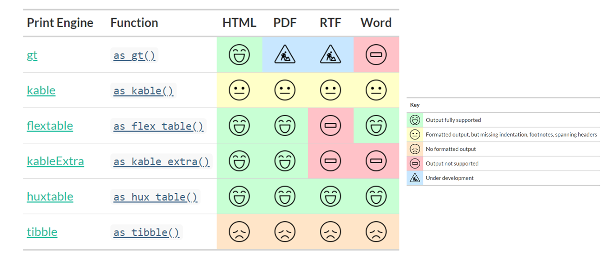
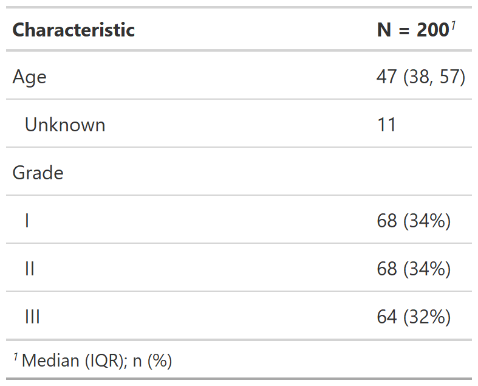

class: inverse, center, middle
# {gtsummary} print engines


---
# {gtsummary} print engines

<p align="center"></p>

---
# {gtsummary} print engines

Use any print engine to customize table

.pull-left[
```{r}
library(gt, warn.conflicts = FALSE)

print_engine <-
  trial %>%
  select(age, grade) %>%
  tbl_summary() %>%
  as_gt() %>%
  cols_width(label ~ px(300)) %>%
  cols_align(columns = vars(stat_0), 
             align = "left")
```

```{r, include=FALSE}
my_gtsave("print_engine")
```
]

.pull-right[
<p align="center"></p>
]
