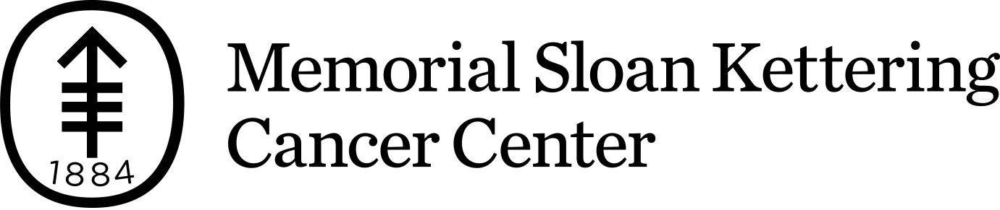
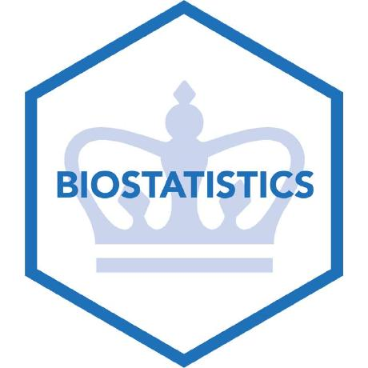

```{r setup, include=FALSE, warning=FALSE}
knitr::opts_chunk$set(echo = TRUE, warning = FALSE)

set.seed(78987)
library(xaringanthemer)
library(gtsummary)

style_mono_accent(
  base_color = mskRvis::msk_palette("main")[1]
)

# xaringan::inf_mr() 
options(htmltools.dir.version = FALSE) 

# helper function to save gtsummary objects
my_gtsave <- function(x) {
  # if being knitted, then skip (save your objects before you knit)
  if (isTRUE(getOption('knitr.in.progress'))) return(invisible(NULL))
   
  path <- file.path("Images", paste0(x, ".png"))
  x <- eval(parse(text=x)) 
  if (inherits(x, "gtsummary")) x <- as_gt(x) 
  gt::gtsave(x, path)   
}    
```


class: inverse, center, title-slide, middle

# Presentation-ready Summary Tables with {gtsummary}

### Daniel D. Sjoberg

#### April 27, 2021


<p align="center"></p>

.medium[
`r icons::fontawesome("twitter") %>% icons::icon_style(fill = "#FFFFFF")` @statistishdan
`r icons::fontawesome("github")  %>% icons::icon_style(fill = "#FFFFFF")` @ddsjoberg
]

---
# About me

.left-column[





]

.right-column[
.medium[

* MA in Biostatistics from the **Boston University**

<br>
<br>

* Senior Research Biostatistician at **Memorial Sloan Kettering Cancer Center**

<br>

* DrPH Candidate in Biostatistics at  **Columbia University**

]

]


---
```{r child='01-background.Rmd'}
```


---
```{r child='02-trial.Rmd'}
```


---
```{r child='03-tbl_summary.Rmd'}
```


---
```{r child='04-tbl_regression.Rmd'}
```


---
```{r child='05-inline_text.Rmd'}
```


---
```{r child='06-tbl_merge.Rmd'}
```


---
```{r child='07-themes.Rmd'}
```


---
```{r child='08-print_engines.Rmd'}
```


---
```{r child='09-summary.Rmd'}
```


